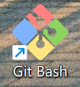
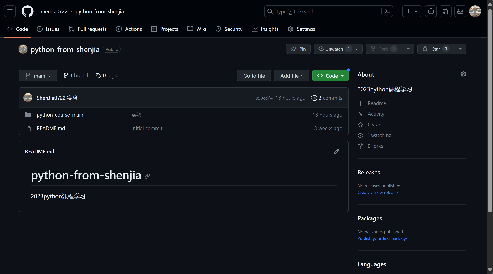
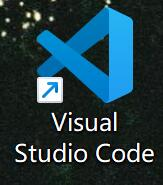
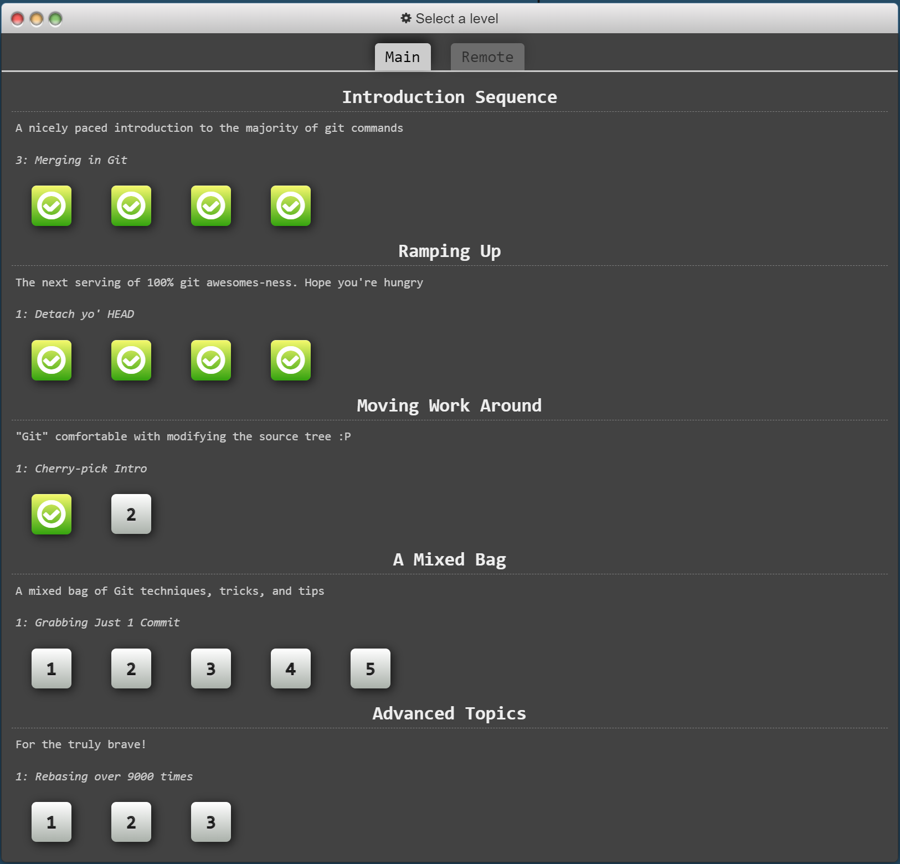

# 实验一 Git和Markdown基础

班级： 21计科1班

学号： B20210302118

姓名： 申佳

Github地址：<https://github.com/ShenJia0722/python-from-shenjia>

---

## 实验目的

1. Git基础，使用Git进行版本控制
2. Markdown基础，使用Markdown进行文档编辑

## 实验环境

1. Git
2. VSCode
3. VSCode插件

## 实验内容和步骤

### 第一部分 实验环境的安装

1. 安装git，从git官网下载后直接点击可以安装：[git官网地址](https://git-scm.com/)
   
2. 从Github克隆课程的仓库：[课程的仓库地址](https://github.com/zhoujing204/python_course)，运行git bash应用（该应用包含在git安装包内），在命令行输入下面的命令（命令运行成功后，课程仓库会默认存放在Windows的用户文件夹下）

```bash
git clone https://github.com/zhoujing204/python_course.git
```

如果你在使用`git clone`命令时遇到SSL错误，请运行下面的git命令(这里假设你的Git使用了默认安装目录)：

```bash
git config --global http.sslCAInfo C:/Program Files/Git/mingw64/ssl/certs/ca-bundle.crt
```

该仓库的课程材料后续会有更新，如果需要更新课程材料，可以在本地课程仓库的目录下运行下面的命令：

```bash
git pull
```

3. 注册Github账号，创建一个新的仓库，用于存放实验报告和实验代码。
   
4. 安装VScode，下载地址：[Visual Studio Code](https://code.visualstudio.com/)
   
   
5. 安装下列VScode插件
   - GitLens
   - Git Graph
   - Git History
   - Markdown All in One
   - Markdown Preview Enhanced
   - Markdown PDF
   - Auto-Open Markdown Preview
   - Paste Image
   - markdownlint

### 第二部分 Git基础

教材《Python编程从入门到实践》P440附录D：使用Git进行版本控制，按照教材的步骤，完成Git基础的学习。

### 第三部分 learngitbranching.js.org

访问[learngitbranching.js.org](https://learngitbranching.js.org)，如下图所示完成Main部分的Introduction Sequence和Ramping Up两个小节的学习。



上面你学习到的git命令基本上可以应付百分之九十以上的日常使用，如果你想继续深入学习git，可以：

- 继续学习[learngitbranching.js.org](https://learngitbranching.js.org)后面的几个小节（包括Main和Remote）
- 在日常的开发中使用git来管理你的代码和文档，用得越多，记得越牢
- 在git使用过程中，如果遇到任何问题，例如：错误删除了某个分支、从错误的分支拉取了内容等等，请查询[git-flight-rules](https://github.com/k88hudson/git-flight-rules)

### 第四部分 Markdown基础

查看[Markdown cheat-sheet](http://www.markdownguide.org/cheat-sheet)，学习Markdown的基础语法

使用Markdown编辑器（例如VScode）编写本次实验的实验报告，包括[实验过程与结果](#实验过程与结果)、[实验考查](#实验考查)和[实验总结](#实验总结)，并将其导出为 **PDF格式** 来提交。

## 实验过程与结果

请将实验过程中编写的代码和运行结果放在这里，注意代码需要使用markdown的代码块格式化，例如Git命令行语句应该使用下面的格式：


显示效果如下：

```bash
git init
git add .
git status
git commit -m "first commit"
```

如果是Python代码，应该使用下面代码块格式，例如：


显示效果如下：

```python
def add_binary(a,b):
    return bin(a+b)[2:]
```

代码运行结果的文本可以直接粘贴在这里。

**注意：不要使用截图，Markdown文档转换为Pdf格式后，截图可能会无法显示。**

---
## 实验考查

请使用自己的语言回答下面的问题，这些问题将在实验检查时用于提问和答辩，并要求进行实际的操作。

1. 什么是版本控制？使用 Git作为版本控制软件有什么优点？<br>
   答：版本控制是在开发的过程中用于管理我们对文件、目录或工程等内容的修改历史，方便查看更改历史记录，备份以便恢复以前的版本的软件工程技术。
   其优点有：①实现跨区域多人协同开发
            ②追踪和记载一个或者多个文件的历史记录
            ③组织和保护你的源代码和文档
            ④ 统计工作量
            ⑤并行开发、提高开发效率
            ⑥跟踪记录整个软件的开发过程
            ⑦减轻开发人员的负担，节省时间，同时降低人为错误
<br>
2. 如何使用Git撤销还没有Commit的修改？如何使用Git检出（Checkout）已经以前的Commit？（实际操作）<br>
   答：
   Ⅰ.git checkout 命令撤销对单个文件的修改：
   ```bash
   git checkout --<文件名>
   ```
   →文件恢复到最后一次 commit 或者 add 的状态。
   <br>

    Ⅱ.git stash 命令暂存所有未提交的修改：
   ```bash
   git stash
   ```
   →所有未提交的修改保存在一个临时的 stash 中，并将工作区的状态恢复到最后一次commit 的状态。<br>
    git checkout 命令加上 commit 的哈希值或者分支名：
    ```bash
   git checkout <commit哈希值/分支名>
   ```
   →切换到指定的 commit，并将工作区的文件恢复到该 commit 的状态。
   <br>
3. Git中的HEAD是什么？如何让HEAD处于detached HEAD状态？（实际操作）<br>
   答：Git中的HEAD是指向当前所在分支的指针。它通常指向最新的提交（commit）。通过HEAD，我们可以确定当前所在分支以及当前工作目录的状态。<br>
   ①git log 命令查看当前分支的提交历史,找到要切换到的特定提交的哈希值:
   ```bash
   git log
   ```
   
   ②git checkout <commit-hash> 命令将HEAD指向该特定提交：
   ```bash
   git checkout <commit-hash> 
   ```
   <br>

4.  什么是分支（Branch）？如何创建分支？如何切换分支？（实际操作）<br>
   答：分支（Branch）是版本控制系统中的一种功能，它允许在同一个代码库中同时进行多个独立的开发线程。每个分支都是代码的一个副本，开发人员可以在分支上进行独立的修改，而不会影响到主分支（通常是主线开发）或其他分支。<br>
     创建分支:
    ```bash
    git branch <名称>
    ```
    切换分支:
    ```bash
     git checkout <名称> 
    ```
5. 如何合并分支？git merge和git rebase的区别在哪里？（实际操作）<br>
   答：在 Git 中，合并分支可以使用 git merge 或 git rebase 命令来实现。它们的区别在于合并的方式和结果：<br>
   Ⅰ.使用 git merge 命令合并分支时，Git 会创建一个新的合并提交（merge commit），将两个分支的更改集成到一个新的提交中。这种合并方式会保留分支的历史记录，并且每个合并提交都能够清晰地表示分支的合并点。
   要合并分支，首先需要切换到目标分支，然后运行以下命令：
   ```bash
     git merge <branch-name>
    ```
    其中 <branch-name> 是要合并的源分支的名称。这将会将源分支的更改合并到当前所在的目标分支中。<br>
    Ⅱ.使用 git rebase 命令合并分支时，Git 会将当前所在的分支的更改移动到目标分支的最新提交之后。这样做可以使提交历史线性化，避免了合并提交的产生。但是，由于更改被重新应用到目标分支的最新提交上，因此会改写提交历史。<br>
    要合并分支，首先需要切换到当前所在的分支，然后运行以下命令：
    ```bash
     git rebase <branch-name>
    ```
    其中 <branch-name> 是要合并到的目标分支的名称。这将会将当前分支的更改移到目标分支的最新提交之后。<br>
    总结:git merge 会创建一个新的合并提交，保留分支历史记录，而 git rebase 会将当前分支的更改移动到目标分支的最新提交之后，线性化提交历史。
<br>
6. 如何在Markdown格式的文本中使用标题、数字列表、无序列表和超链接？（实际操作）<br>
   答：
   标题：
   # 一级标题
    ## 二级标题
    ### 三级标题
   ```bash
    # 一级标题
    ## 二级标题
    ### 三级标题
    ```
    数字列表：
    1. 第一项
    2. 第二项
    ```bash
    1. 第一项
    2. 第二项
    ```
    无序列表：
    * 第一项

    + 第一项

    - 第一项
    ```bash
    * 第一项

    + 第一项

    - 第一项
    ```
    超链接：
    <a href="https://github.com/ShenJia0722">我的GitHub主页</a>
    [GitHub实验仓库](https://github.com/ShenJia0722/python-from-shenjia)
    ```bash
    <a href="https://github.com/ShenJia0722">我的Github主页</a>
    ```
    ```bash
    [GitHub实验仓库](https://github.com/ShenJia0722/python-from-shenjia)
    ```
## 实验总结

总结一下这次实验你学习和使用到的知识，例如：编程工具的使用、数据结构、程序语言的语法、算法、编程技巧、编程思想：<br>
首先是学习了Git的使用，通过使用命令行对文件进行操作，并将内容上传到托管仓库，在亲自仔细实践过后，对该板块有了一定的熟悉。<br>

然后是用Markdown写说明文件，在一些的html基础知识的加持下，能够较顺利完成工整的文件书写。

最后，要感谢为我答疑解惑的同学和老师，知识需要不断运用与实践，去温习和巩固，才能将今后的实验完成更优秀和高效。
