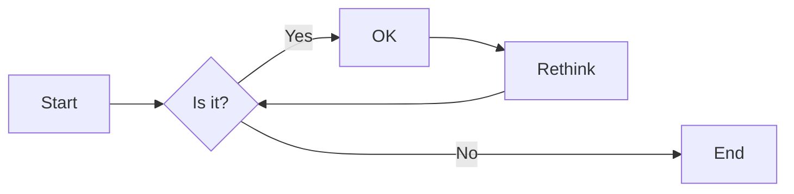
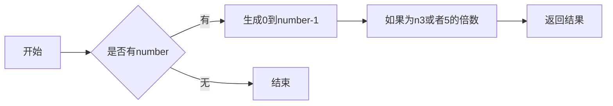
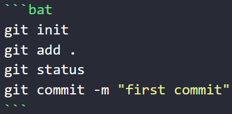
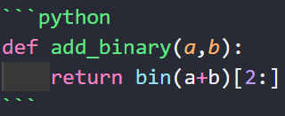

# 实验三 Python列表

班级： 21计科1班

学号： B20210302118

姓名： 申佳

Github地址：<https://github.com/ShenJia0722/python-from-shenjia>

CodeWars地址：<https://www.codewars.com/users/Belief_V>

---

## 实验目的

1. 学习Python的简单使用和列表操作
2. 学习Python中的if语句

## 实验环境

1. Git
2. Python 3.10
3. VSCode
4. VSCode插件

## 实验内容和步骤

### 第一部分

Python列表操作

完成教材《Python编程从入门到实践》下列章节的练习：

- 第3章 列表简介
- 第4章 操作列表
- 第5章 if语句

---

### 第二部分

在[Codewars网站](https://www.codewars.com)注册账号，完成下列Kata挑战：

---

#### 第一题：3和5的倍数（Multiples of 3 or 5）

难度： 6kyu

如果我们列出所有低于 10 的 3 或 5 倍数的自然数，我们得到 3、5、6 和 9。这些数的总和为 23. 完成一个函数，使其返回小于某个整数的所有是3 或 5 的倍数的数的总和。此外，如果数字为负数，则返回 0。

注意：如果一个数同时是3和5的倍数，应该只被算一次。

**提示：首先使用列表解析得到一个列表，元素全部是3或者5的倍数。
使用sum函数可以获取这个列表所有元素的和.**

代码提交地址：
<https://www.codewars.com/kata/514b92a657cdc65150000006>

实验代码：
```python
def solution(number):
    
    # 从0到number-1的整数
    numbers = [i for i in range(number)]
    
    # 从0到number-1的整数中，3或者5的倍数
    multi3or5 =  [i for i in range(number) if i%3==0 or i%5==0]
    
    # 返回结果
    return sum(multi3or5) 
```
---

#### 第二题： 重复字符的编码器（Duplicate Encoder）

难度： 6kyu

本练习的目的是将一个字符串转换为一个新的字符串，如果新字符串中的每个字符在原字符串中只出现一次，则为"("，如果该字符在原字符串中出现多次，则为")"。在判断一个字符是否是重复的时候，请忽略大写字母。

例如:

```python
"din"      =>  "((("
"recede"   =>  "()()()"
"Success"  =>  ")())())"
"(( @"     =>  "))(("
```

代码提交地址:
<https://www.codewars.com/kata/54b42f9314d9229fd6000d9c>

实验代码：
```python
def duplicate_encode(word):
    # 用来保存括号的列表
    result = []
    
    # 将所有字符全部变成小写
    word = word.lower()
    
    # 遍历单词中所有的字符
    for c in word:
        # 如果该字符出现次数大于1次，在列表中添加`)`
        if word.count(c) > 1:
            result.append(')')
        # 如果该字符出现次数大于1次，在列表中添加`(`
        else:
            result.append('(') 
    
    # 将列表中的括号连接成字符串返回
    return ''.join(result)
```
---

#### 第三题：括号匹配（Valid Braces）

难度：6kyu

写一个函数，接收一串括号，并确定括号的顺序是否有效。如果字符串是有效的，它应该返回True，如果是无效的，它应该返回False。
例如：

```python
"(){}[]" => True 
"([{}])" => True
 "(}" => False
 "[(])" => False 
"[({})](]" => False
```

**提示：
python中没有内置堆栈数据结构，可以直接使用`list`来作为堆栈，其中`append`方法用于入栈，`pop`方法可以出栈。**

代码提交地址
<https://www.codewars.com/kata/5277c8a221e209d3f6000b56>

实验代码：
```python
braces = "(){}[]" # 括号字符串
dict_braces = {'}': '{', ']': '[', ')': '('}

def validBraces(string):
    stack = [] # 用来保存括号的栈
    for c in string:
        # 如果是左括号，就入栈
        if c in '({[':
            stack.append(c)
        # 如果是右括号
        elif c in ')}]':
            # 如果栈为空，返回False
            if not stack:
                return False
            # 如果栈顶元素和当前元素不匹配，返回False
            if stack[-1] != dict_braces[c]:
                return False
            # 如果栈顶元素和当前元素匹配，就出栈
            else:
                stack.pop()
    # 如果栈为空，返回True
    if not stack:
        return True
    # 如果栈不为空，返回False
    else:
        return False
```
---

#### 第四题： 从随机三元组中恢复秘密字符串(Recover a secret string from random triplets)

难度： 4kyu

有一个不为你所知的秘密字符串。给出一个随机三个字母的组合的集合，恢复原来的字符串。

这里的三个字母的组合被定义为三个字母的序列，每个字母在给定的字符串中出现在下一个字母之前。"whi "是字符串 "whatisup "的一个三个字母的组合。

作为一种简化，你可以假设没有一个字母在秘密字符串中出现超过一次。

对于给你的三个字母的组合，除了它们是有效的三个字母的组合以及它们包含足够的信息来推导出原始字符串之外，你可以不做任何假设。特别是，这意味着秘密字符串永远不会包含不出现在给你的三个字母的组合中的字母。

测试用例：

```python
secret = "whatisup"
triplets = [
  ['t','u','p'],
  ['w','h','i'],
  ['t','s','u'],
  ['a','t','s'],
  ['h','a','p'],
  ['t','i','s'],
  ['w','h','s']
]
test.assert_equals(recoverSecret(triplets), secret)
```

代码提交地址：
<https://www.codewars.com/kata/53f40dff5f9d31b813000774/train/python>

提示：

- 利用集合去掉`triplets`中的重复字母，得到字母集合`letters`，最后的`secret`应该由集合中的字母组成，`secret`长度也等于该集合。

```python
letters = {letter for triplet in triplets for letter in triplet }
length = len(letters)
```

- 创建函数`check_first_letter(triplets, first_letter)`，检测一个字母是不是secret的首字母，返回True或者False。
- 创建函数`remove_first_letter(triplets, first_letter)`,  从三元组中去掉首字母，返回新的三元组。
- 遍历字母集合letters，利用上面2个函数得到最后的结果`secret`。

实验代码：
```python
def recoverSecret(triplets):
    # 创建字典用于存储字符的相对顺序
    graph = {}

    # 构建图，记录字符的相对顺序
    for triplet in triplets:
        for char in triplet:
            if char not in graph:
                graph[char] = set()
    
        graph[triplet[0]].add(triplet[1])
        graph[triplet[1]].add(triplet[2])

    # 使用深度优先搜索（DFS）拓扑排序获取字符的正确顺序
    visited = set()
    result = []

    def dfs(node):
        if node not in visited:
            visited.add(node)
            for neighbor in graph[node]:
                dfs(neighbor)
            result.append(node)

    for node in graph:
        dfs(node)

    # 返回拓扑排序的逆序，即原始字符串
    return ''.join(result[::-1])
```
---

#### 第五题： 去掉喷子的元音（Disemvowel Trolls）

难度： 7kyu

喷子正在攻击你的评论区!
处理这种情况的一个常见方法是删除喷子评论中的所有元音(字母：a,e,i,o,u)，以消除威胁。
你的任务是写一个函数，接收一个字符串并返回一个去除所有元音的新字符串。
例如，字符串 "This website is for losers LOL!"   将变成 "Ths wbst s fr lsrs LL!".

注意：对于这个Kata来说，y不被认为是元音。
代码提交地址：
<https://www.codewars.com/kata/52fba66badcd10859f00097e>

提示：

- 首先使用列表解析得到一个列表，列表中所有不是元音的字母。
- 使用字符串的join方法连结列表中所有的字母，例如：

```python
last_name = "lovelace"
letters = [letter for letter in last_name ]
print(letters) # ['l', 'o', 'v', 'e', 'l', 'a', 'c', 'e']
name = ''.join(letters) # name = "lovelace"
```

实验代码：
```python
def disemvowel(string_):
    vowels = 'aeiouAEIOU'
    disemvoweled_string = ''.join([char for char in string_ if char not in vowels])
    return disemvoweled_string
```
---

### 第三部分

使用Mermaid绘制程序流程图

安装VSCode插件：

- Markdown Preview Mermaid Support
- Mermaid Markdown Syntax Highlighting

使用Markdown语法绘制你的程序绘制程序流程图（至少一个），Markdown代码如下：


显示效果如下：




查看Mermaid流程图语法-->[点击这里](https://mermaid.js.org/syntax/flowchart.html)

使用Markdown编辑器（例如VScode）编写本次实验的实验报告，包括[实验过程与结果](#实验过程与结果)、[实验考查](#实验考查)和[实验总结](#实验总结)，并将其导出为 **PDF格式** 来提交。

第一题：3和5的倍数（Multiples of 3 or 5）

程序流程图：



## 实验过程与结果

请将实验过程与结果放在这里，包括：

- [第一部分 Python列表操作和if语句](#第一部分)
- [第二部分 Codewars Kata挑战](#第二部分)
- [第三部分 使用Mermaid绘制程序流程图](#第三部分)

注意代码需要使用markdown的代码块格式化，例如Git命令行语句应该使用下面的格式：



显示效果如下：

```bash
git init
git add .
git status
git commit -m "first commit"
```

如果是Python代码，应该使用下面代码块格式，例如：



显示效果如下：

```python
def add_binary(a,b):
    return bin(a+b)[2:]
```

代码运行结果的文本可以直接粘贴在这里。

**注意：不要使用截图，Markdown文档转换为Pdf格式后，截图可能会无法显示。**

## 实验考查

请使用自己的语言并使用尽量简短代码示例回答下面的问题，这些问题将在实验检查时用于提问和答辩以及实际的操作。

1. Python中的列表可以进行哪些操作？
答：列表可以进行的操作有：
  ①增加元素：使用append()方法在列表末尾添加一个元素，使用insert()方法在指定位置插入一个元素，使用extend()方法将另一个列表中的元素添加到该列表末尾。
  ②删除元素：使用remove()方法删除指定元素，使用pop()方法删除指定位置的元素并返回该元素，使用del语句删除指定位置的元素。
  ③修改元素：通过索引直接修改指定位置的元素。
  ④查找元素：使用index()方法查找指定元素在列表中的位置，使用count()方法统计指定元素在列表中出现的次数。
  ⑤切片操作：通过切片操作可以获取列表中的一部分元素，例如list[1:3]表示获取列表中索引从1到2的元素。
  ⑥排序：使用sort()方法对列表进行升序排序，使用reverse()方法将列表倒序。
  ⑦迭代：使用for循环可以遍历列表中的所有元素。
  ⑧其他操作：可以使用len()函数获取列表的长度，使用in关键字判断某个元素是否在列表中，使用+运算符将两个列表合并成一个新列表。
  <br></br>
1. 哪两种方法可以用来对Python的列表排序？这两种方法有和区别？
答：Python的列表可以通过sort()方法和sorted()函数进行排序。两种方法的主要区别是sort()方法会改变原列表，而sorted()函数不会改变原列表，返回一个新的排序后的列表。因此，如果需要保留原列表，可以使用sorted()函数，否则可以使用sort()方法。
  sort()方法：该方法会在原列表上直接进行排序，不会返回新的列表，使用方法为list.sort()。可以通过参数reverse指定是否降序排序，默认为升序排序。
  sorted()函数：该函数会返回一个新的排序后的列表，不会影响原列表，使用方法为sorted(list)。可以通过参数reverse指定是否降序排序，默认为升序排序。<br></br>

1. 如何将Python列表逆序打印？
答：Python中可以使用reverse()方法将列表逆序，然后使用for循环遍历列表并打印。
```python
my_list = [1, 2, 3, 4, 5]
my_list.reverse()  # 将列表逆序
for item in my_list:
    print(item)
```
<br></br>

1. Python中的列表执行哪些操作时效率比较高？哪些操作效率比较差？是否有类似的数据结构可以用来替代列表？
答：
操作时效率较高的有：
  ①获取列表中某个元素的值，使用索引list[i]。
  ②在列表末尾添加元素，使用append()方法。
  ③切片操作list[i:j]。
  ④遍历列表，使用for循环。
操作时效率较差的有：
  ①在列表中间插入或删除元素，使用insert()、remove()、pop()等方法。
  ②判断列表中是否包含某个元素，使用in操作符或index()方法。
  ③对列表进行排序，使用sort()方法或sorted()函数。
<br></br>
1. 阅读《Fluent Python》Chapter 2. An Array of Sequence - Tuples Are Not Just Immutable Lists小节（p30-p35）。总结该小节的主要内容。
答：主要讲解了Python中的元组（Tuple）数据类型，总结如下：
  ①元组是不可变的有序序列，可以包含任意类型的元素，用逗号分隔。元组的不可变性意味着元组的长度和元素不可更改。元组可以通过圆括号或者省略括号的方式创建。
  ②元组可以通过索引访问元素，也可以通过切片操作获取子元组。元组的索引从0开始，可以使用负数索引从后往前访问元素。元组支持切片操作，可以通过切片操作获取元组的子元组。
  ③元组可以作为字典的键，因为元组是不可变的，不会发生哈希冲突。字典中的键必须是不可变类型，因此元组可以作为字典的键。
  ④元组可以作为函数的参数和返回值，可以用于简单的数据结构传递。元组可以作为函数的参数和返回值，可以用于简单的数据结构传递，因为元组是不可变的，可以保证传递的数据不会被修改。
  ⑤元组可以用于多个变量的赋值操作，可以方便地交换两个变量的值。多个变量可以同时赋值为一个元组，也可以通过解包元组的方式将元组的值分配给多个变量。通过多个变量的赋值操作可以方便地交换两个变量的值。
  ⑥元组可以使用+运算符将两个元组合并成一个新元组，也可以使用*运算符将元组重复多次。使用+运算符可以将两个元组合并成一个新元组，使用*运算符可以将元组重复多次。
  ⑦元组中的元素可以是可变对象，但元组本身不可变，因此元组中的可变对象不能被修改，但可以修改其属性。元组中的元素可以是可变对象，例如列表，但元组本身不可变，因此元组中的可变对象不能被修改，但可以修改其属性。
  ⑧namedtuple是一种具名元组，可以用于定义简单的数据结构，提高代码可读性。namedtuple是一种具名元组，可以通过字段名来访问元组中的元素，提高了代码的可读性。
  ⑨元组和列表的选择取决于具体的应用场景，如果需要存储的元素是不可变的，建议使用元组，否则使用列表。元组和列表都是序列类型，可以存储多个元素。元组适用于存储不可变的数据，例如日期、时间等，而列表适用于存储可变的数据，例如用户列表等。
## 实验总结

总结一下这次实验你学习和使用到的知识，例如：编程工具的使用、数据结构、程序语言的语法、算法、编程技巧、编程思想。<br></br>
此次实验过程中，实验步骤能够流畅进行，从完成题目到提交实验报告能够较为顺利的完成。对于实验中的编程练习，在思路、想法的实现以及代码设计上还有很大的进步空间，老师和同学的帮助和解答使我能够将问题解决，在代码设计上还是需要牢固基础。